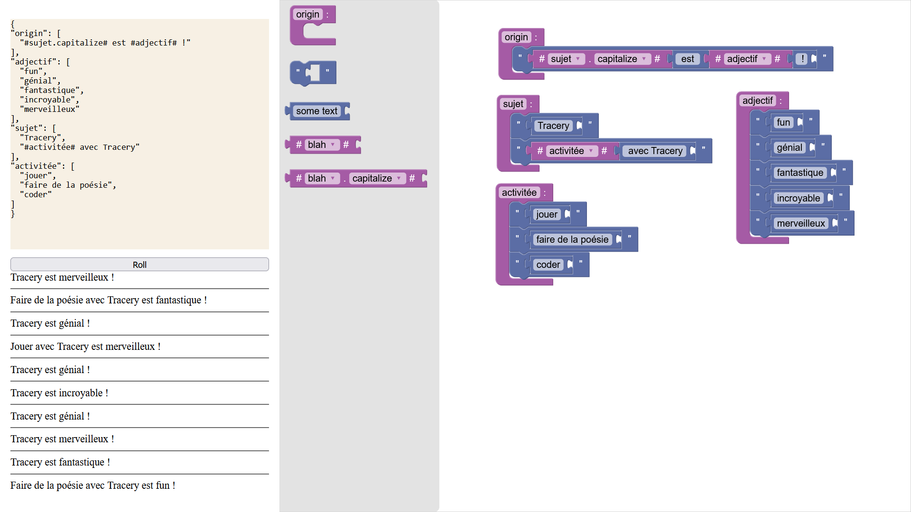

# blockly-for-tracery

A [Blockly](https://developers.google.com/blockly) app to easily do generative text with [Tracery](https://tracery.io/). So basically, it is visual programming for art.

[](https://loic-fejoz.github.io/blockly-for-tracery?lang=fr#eyJibG9ja3MiOnsibGFuZ3VhZ2VWZXJzaW9uIjowLCJibG9ja3MiOlt7InR5cGUiOiJSVUxFIiwiaWQiOiI7YCpCP1kjYV13fildYkpLPUJ0LSIsIngiOjkxLCJ5Ijo0MywiZmllbGRzIjp7InJ1bGVfbmFtZSI6Im9yaWdpbiJ9LCJpbnB1dHMiOnsidmFsdWUiOnsiYmxvY2siOnsidHlwZSI6IkFMVEVSTkFUSVZFIiwiaWQiOiJaOzlteEdGLi0zLDRhS1Q9PTdXSyIsImlucHV0cyI6eyJjb250ZW50Ijp7ImJsb2NrIjp7InR5cGUiOiJDT05URU5UX01PRElGSUVSIiwiaWQiOiJVY258PSE0eltPZmZvTElQJH1jPSIsImZpZWxkcyI6eyJydWxlX25hbWUiOiJzdWpldCIsIm1vZGlmaWVyIjoiY2FwaXRhbGl6ZSJ9LCJpbnB1dHMiOnsibmV4dCI6eyJibG9jayI6eyJ0eXBlIjoiU1RSX0NPTlRFTlQiLCJpZCI6In5GYEhmeF11TH19LUd4SnB5aiw1IiwiZmllbGRzIjp7InN0cl92YWwiOiIgZXN0ICJ9LCJpbnB1dHMiOnsibmV4dCI6eyJibG9jayI6eyJ0eXBlIjoiUlVMRV9DQUxMIiwiaWQiOiI7eF9uKnglZnpYYCVGMWZMMyt5SCIsImZpZWxkcyI6eyJydWxlX25hbWUiOiJhZGplY3RpZiJ9LCJpbnB1dHMiOnsibmV4dCI6eyJibG9jayI6eyJ0eXBlIjoiU1RSX0NPTlRFTlQiLCJpZCI6IjhjXlNINkMxWV1xQGl2eC5yKGlAIiwiZmllbGRzIjp7InN0cl92YWwiOiIgISJ9fX19fX19fX19fX19fX19fSx7InR5cGUiOiJSVUxFIiwiaWQiOiJuSkoydGp0Oyl1b2Jfc0YjW2stMCIsIngiOjQ1OSwieSI6MTQxLCJmaWVsZHMiOnsicnVsZV9uYW1lIjoiYWRqZWN0aWYifSwiaW5wdXRzIjp7InZhbHVlIjp7ImJsb2NrIjp7InR5cGUiOiJBTFRFUk5BVElWRSIsImlkIjoiRDBWJWk7OCw3YCRpNk5pfGhNbjAiLCJpbnB1dHMiOnsiY29udGVudCI6eyJibG9jayI6eyJ0eXBlIjoiU1RSX0NPTlRFTlQiLCJpZCI6Ik9heHF5dGUlMjF+NW1UOlE2bkZGIiwiZmllbGRzIjp7InN0cl92YWwiOiJmdW4ifX19fSwibmV4dCI6eyJibG9jayI6eyJ0eXBlIjoiQUxURVJOQVRJVkUiLCJpZCI6Iml9bHRaKDpsTmkuWT8vS2k3OkZ+IiwiaW5wdXRzIjp7ImNvbnRlbnQiOnsiYmxvY2siOnsidHlwZSI6IlNUUl9DT05URU5UIiwiaWQiOiIvS2B5dCk3Z24sXi1tYkF3dmxGKiIsImZpZWxkcyI6eyJzdHJfdmFsIjoiZ+luaWFsIn19fX0sIm5leHQiOnsiYmxvY2siOnsidHlwZSI6IkFMVEVSTkFUSVZFIiwiaWQiOiJjaiEkVy1+Pzl6fWBXWW1ReX46ciIsImlucHV0cyI6eyJjb250ZW50Ijp7ImJsb2NrIjp7InR5cGUiOiJTVFJfQ09OVEVOVCIsImlkIjoiTko6OGVMfi98bzNjcy9NeWszU2QiLCJmaWVsZHMiOnsic3RyX3ZhbCI6ImZhbnRhc3RpcXVlIn19fX0sIm5leHQiOnsiYmxvY2siOnsidHlwZSI6IkFMVEVSTkFUSVZFIiwiaWQiOiJCS3UkOjc6XTFQNEY7aHFbUT11ayIsImlucHV0cyI6eyJjb250ZW50Ijp7ImJsb2NrIjp7InR5cGUiOiJTVFJfQ09OVEVOVCIsImlkIjoialRNcTliOUpORGc2bS9QfCQzWVQiLCJmaWVsZHMiOnsic3RyX3ZhbCI6ImluY3JveWFibGUifX19fSwibmV4dCI6eyJibG9jayI6eyJ0eXBlIjoiQUxURVJOQVRJVkUiLCJpZCI6InJoWHlpYUlTbiNwZy1dPTVgYU5DIiwiaW5wdXRzIjp7ImNvbnRlbnQiOnsiYmxvY2siOnsidHlwZSI6IlNUUl9DT05URU5UIiwiaWQiOiJ4WUYyLnNKPWZEYE1hVnQyWzhdciIsImZpZWxkcyI6eyJzdHJfdmFsIjoibWVydmVpbGxldXgifX19fX19fX19fX19fX19fSx7InR5cGUiOiJSVUxFIiwiaWQiOiJpU1kvYXY9YGE4THRYVEx2NCNZJSIsIngiOjg5LCJ5IjoxNDcsImZpZWxkcyI6eyJydWxlX25hbWUiOiJzdWpldCJ9LCJpbnB1dHMiOnsidmFsdWUiOnsiYmxvY2siOnsidHlwZSI6IkFMVEVSTkFUSVZFIiwiaWQiOiIxJTlHSz9LMTlJJCUqbFBMazlvayIsImlucHV0cyI6eyJjb250ZW50Ijp7ImJsb2NrIjp7InR5cGUiOiJTVFJfQ09OVEVOVCIsImlkIjoidEo0UUFeY2p9KnxVLlVSTGAuRGkiLCJmaWVsZHMiOnsic3RyX3ZhbCI6IlRyYWNlcnkifX19fSwibmV4dCI6eyJibG9jayI6eyJ0eXBlIjoiQUxURVJOQVRJVkUiLCJpZCI6Im0xUG9UQyo3bi9KfHh6O0h0anJMIiwiaW5wdXRzIjp7ImNvbnRlbnQiOnsiYmxvY2siOnsidHlwZSI6IlJVTEVfQ0FMTCIsImlkIjoiUiFQL0FaXTE/XWg1QjEzNzRpa1siLCJmaWVsZHMiOnsicnVsZV9uYW1lIjoiYWN0aXZpdOllIn0sImlucHV0cyI6eyJuZXh0Ijp7ImJsb2NrIjp7InR5cGUiOiJTVFJfQ09OVEVOVCIsImlkIjoiKG5adiwqN3QjVU5pd1BEQEtnfWMiLCJmaWVsZHMiOnsic3RyX3ZhbCI6IiBhdmVjIFRyYWNlcnkifX19fX19fX19fX19fSx7InR5cGUiOiJSVUxFIiwiaWQiOiI5U0VjNWxzVz9jWkZhUT90IUU9fiIsIngiOjg3LCJ5IjoyODQsImZpZWxkcyI6eyJydWxlX25hbWUiOiJhY3Rpdml06WUifSwiaW5wdXRzIjp7InZhbHVlIjp7ImJsb2NrIjp7InR5cGUiOiJBTFRFUk5BVElWRSIsImlkIjoicy9kZkQwSWk/c001TDVyYDFfXioiLCJpbnB1dHMiOnsiY29udGVudCI6eyJibG9jayI6eyJ0eXBlIjoiU1RSX0NPTlRFTlQiLCJpZCI6InhuTzlzZHZgdzNlLi9ZKDVPSURRIiwiZmllbGRzIjp7InN0cl92YWwiOiJqb3VlciJ9fX19LCJuZXh0Ijp7ImJsb2NrIjp7InR5cGUiOiJBTFRFUk5BVElWRSIsImlkIjoiWj9ITltvc0JUfVIjTXt9cVY7dEIiLCJpbnB1dHMiOnsiY29udGVudCI6eyJibG9jayI6eyJ0eXBlIjoiU1RSX0NPTlRFTlQiLCJpZCI6IlZwU2xQeXs9U1FMKT1gd31JVCFXIiwiZmllbGRzIjp7InN0cl92YWwiOiJmYWlyZSBkZSBsYSBwb+lzaWUifX19fSwibmV4dCI6eyJibG9jayI6eyJ0eXBlIjoiQUxURVJOQVRJVkUiLCJpZCI6Ing9bTBCVyMuRFtzajZqe3UlW2RYIiwiaW5wdXRzIjp7ImNvbnRlbnQiOnsiYmxvY2siOnsidHlwZSI6IlNUUl9DT05URU5UIiwiaWQiOiI3Q3dZVHVtMUFwUmpmbElIN0VHZCIsImZpZWxkcyI6eyJzdHJfdmFsIjoiY29kZXIifX19fX19fX19fX19XX19)

## Quick Start

🇫🇷 The easiest way is to use it online [for English speaking people](https://loic-fejoz.github.io/blockly-for-tracery?hl=en). Use bookmarks from your browser to save your art.

🇫🇷 Le plus simple est de l'utiliser en ligne [pour les francophones](https://loic-fejoz.github.io/blockly-for-tracery?hl=fr). Utilisez les favoris de votre navigateur pour enregistrer votre art.

## Development

### Quick Dev Start

1. [Install](https://docs.npmjs.com/downloading-and-installing-node-js-and-npm) npm if you haven't before.
2. Run `nvm install v24.0.0` to ensure you have a proper working version of `npm`
3. Run `npm install` to install the required dependencies.
4. Run `npm run start` to run the development server and see the app in action.
5. If you make any changes to the source code, just refresh the browser while the server is running to see them.

### Licence

See [the licence file](./LICENSE), but in short it is Apache License V2.
Note that this project has vendored the [Tracery v2](https://github.com/galaxykate/tracery/blob/tracery2/) project under the same license.
It also leverage the [Blockly library](https://github.com/google/blockly) under the same license.